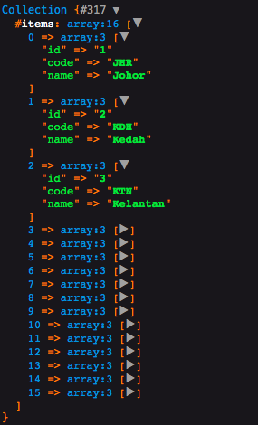

# Laravel collection of Malaysian state list

This package is useful for people who would want to create `dropdown` input or anything that requires the Malaysian States list.

## Installing

`$ composer require aifaiz/myrstates`

## How to use

you can use it in anywhere such as `controller`. declare the `namespace` like this before the `class`

`use AiFaiz\Malaysia\MyStates;`

accessing the states:

`$states = MyStates::getStates()`

Collections of states will be returned and you can perform `collection` method on it. such as:

`$states->first()`


refer to [Collection Methods](https://laravel.com/docs/5.8/collections#available-methods) for more info on utilizing `collections`

## Getting the state name by code

````

$state = MyStates::stateByCode('KUL')
// Kuala Lumpur

````

## Using Alias

You can use it directly in laravel `blade template` like this:

````
<select>
    @foreach(MalayStates::getStates() as $state)
	<option value="{{$state['code']}}">{{$state['name']}}</option>
	@endforeach
</select>

````

## Sample Data



